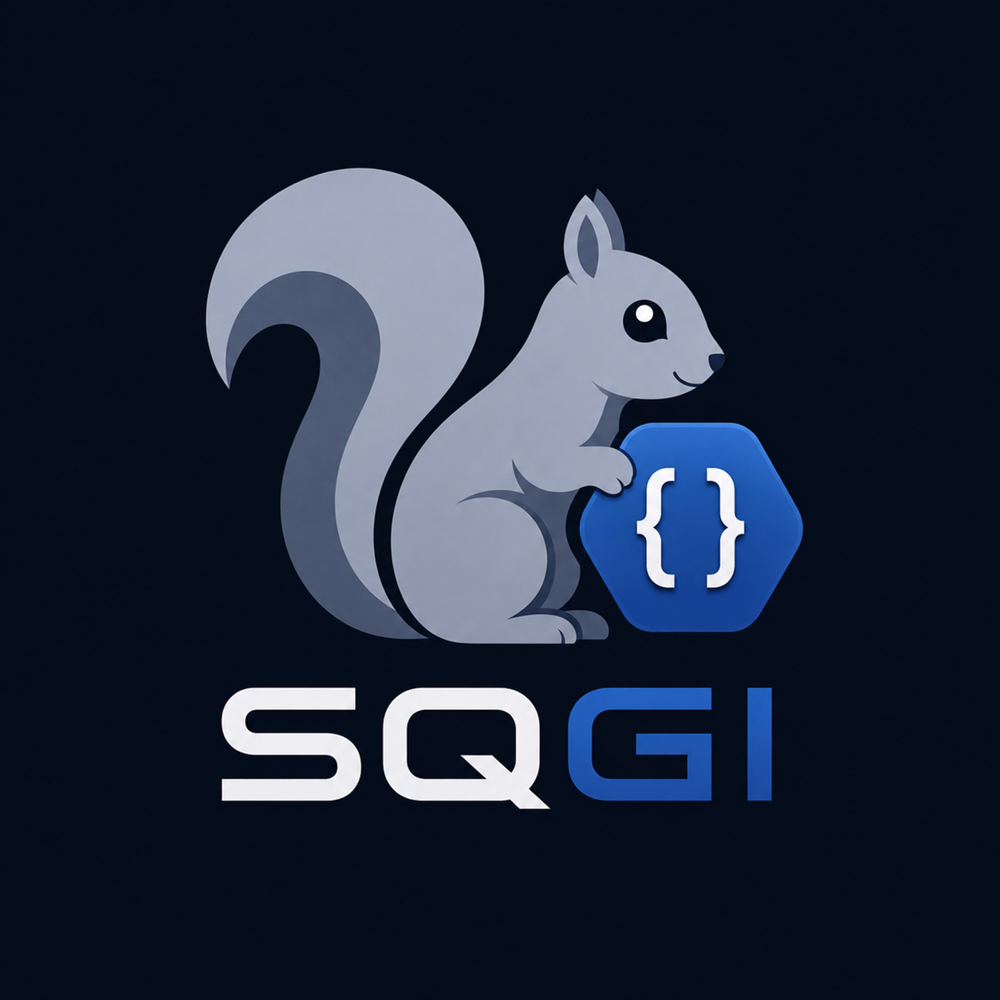

# SQGI

<p align="center">
  
</p>

**SQGI is one of the fastest ways to build and deploy small native
cross-platform GTK/GI apps: write the app, push a tag, get Linux AppImages and
a Windows installer from CI.**

It gives you a compact Squirrel runtime with direct access to real platform
libraries through GObject Introspection. That means you can write desktop,
media, network, and system tools using GTK, Gio, GStreamer, libsoup,
GdkPixbuf, Cairo, and other native libraries without hand-written bindings for
every API.

The result is a practical middle path between heavyweight app platforms and
low-level native code:

- lighter than Electron
- friendlier than writing everything in C or C++
- more portable than GJS for Windows-oriented projects
- easier to extend than a sealed scripting sandbox
- practical to package as AppImages, Windows directories, or NSIS installers

SQGI's goal is simple: **keep scripting pleasant, stay close to the native
platform, and make shipping feel like part of the workflow.**

Read the docs: https://sqgi.readthedocs.io/en/latest/

Join the community on Discord: https://discord.gg/krVe8U9wGm


## What You Can Build

SQGI is useful for:

- GTK 4 desktop applications
- Gio filesystem, networking, process, and application utilities
- GStreamer media tools, overlays, capture utilities, and experiments
- libsoup HTTP clients, API tools, and local services
- GdkPixbuf and Cairo image/graphics utilities
- automation tools that need native OS integration
- scriptable native apps with a C/C++/Vala core
- AppImage and Windows desktop utilities distributed outside a package manager

## Features

- **Squirrel scripting**: closures, classes, exceptions, modules, and compact
  JavaScript-like syntax.
- **Modern async**: `async` / `await`, `Task`, `sqgi.sleep`, `sqgi.all`,
  `sqgi.race`, and `.then()` / `.catch()` chaining.
- **GObject Introspection**: import introspected libraries directly with
  `import("Gtk", "4.0")`, `import("Gio")`, `import("Gst")`, and friends.
- **Native API coverage**: constructors, methods, properties, signals,
  callbacks, `GError`, `GValue`, `GVariant`, byte arrays, boxed values, and
  ownership handling.
- **Native extensions**: call your own C, C++, or Vala GObject libraries through
  normal shared libraries and `.typelib` files.
- **Embeddable runtime**: use SQGI as a standalone interpreter or embed it in a
  native application.
- **Portable packaging**: `sqgipkg` can bundle scripts, resources, typelibs,
  plugins, native libraries, private Linux/Windows dependency sysroots,
  AppImages, Windows app directories, and NSIS installers.
- **AI-friendly workflow**: the runtime is small, the language is familiar, and
  the underlying libraries are well-documented, which makes SQGI practical for
  AI-assisted development.

## A Tiny Demo

```squirrel
#!/usr/bin/env sqgi

local GLib = import("GLib")
local Gio  = import("Gio")

local loop = GLib.MainLoop.new(null, false)

async function main() {
    local file = Gio.File.new_for_path("/etc/os-release")
    local result = await file.load_contents_async(null)
    print(result[0])
    loop.quit()
}

main().catch(function(e) {
    print("error: " + e + "\n")
    loop.quit()
})

loop.run()
```

That is ordinary Squirrel calling native Gio async APIs. No generated bindings,
no per-library glue, and no blocking file read.

## GTK Example

```squirrel
#!/usr/bin/env sqgi

local Gtk = import("Gtk", "4.0")

local app = Gtk.Application.new("org.example.sqgi.demo", 0)

app.connect("activate", function() {
    local win = Gtk.ApplicationWindow.new(app)
    win.title = "SQGI"
    win.set_default_size(360, 180)

    local button = Gtk.Button.new_with_label("Hello from SQGI")
    button.connect("clicked", function() {
        print("clicked\n")
    })

    win.set_child(button)
    win.present()
})

app.run(0, null)
```

## Quick Start

Build from source on Ubuntu/Debian-style systems:

```sh
git clone https://github.com/supercamel/sqgi.git
cd sqgi

sudo apt install cmake build-essential pkg-config \
  libglib2.0-dev libgirepository1.0-dev libffi-dev libcairo2-dev

cmake -S . -B build -DCMAKE_BUILD_TYPE=Release
cmake --build build -j"$(nproc)"

build/sqgi --version
build/sqgi demo/gio/file_read.nut README.md
```

Install:

```sh
sudo cmake --install build --prefix /usr/local
```

On MSYS2, use a MinGW-style shell such as UCRT64 or MINGW64. The helper script
installs the matching CMake, Ninja, compiler, and GLib/GI dependencies:

```sh
./tools/install-msys2-prereqs.sh ucrt64

cmake -S . -B build-ucrt64 -G Ninja \
  -DCMAKE_BUILD_TYPE=Release \
  -DCMAKE_INSTALL_PREFIX=/ucrt64
cmake --build build-ucrt64
cmake --install build-ucrt64
```

This installs:

- `sqgi`
- `sqgipkg`
- `libsqgi.so`
- public headers under `include/sqgi/`
- `sqgi.pc` for `pkg-config`
- `sqgipkg` runtime modules under `share/sqgi/sqgipkg_lib/`
- `sqgipkg` starter templates under `share/sqgi/sqgipkg_templates/`

## Import Native Libraries

Any available introspected namespace can be imported:

```squirrel
local GLib   = import("GLib")
local Gio    = import("Gio")
local Gtk    = import("Gtk", "4.0")
local Gst    = import("Gst")
local Soup   = import("Soup")
local Pixbuf = import("GdkPixbuf")
```

SQGI uses GI metadata at runtime, so broad native APIs become available without
binding generation. The runtime handles common GI shapes including methods,
constructors, properties, signals, callbacks, out parameters, errors, and native
ownership conventions.

## Async / Await

Gio-style `_async` / `_finish` pairs are exposed as awaitable methods:

```squirrel
local Gio = import("Gio")

async function read_text(path) {
    local file = Gio.File.new_for_path(path)
    local result = await file.load_contents_async(null)
    return result[0]
}
```

SQGI also provides task helpers:

```squirrel
local results = await sqgi.all([
    read_text("README.md"),
    read_text("LICENSE")
])
```

## Native Extensions

If your native code exposes GObject Introspection metadata, SQGI can call it.
The usual extension shape is:

```text
native/build/libmyapp-1.0.so
native/build/MyApp-1.0.typelib
```

Then from Squirrel:

```squirrel
local MyApp = import("MyApp", "1.0")
local worker = MyApp.Worker.new()
print(worker.do_native_work("hello") + "\n")
```

This works with hand-written C/C++ GObject libraries and with Vala libraries.
Vala async methods can be awaited directly when exposed through GI.

Working examples live in:

```text
tools/sqgipkg_tests/native_gi_project/
tools/sqgipkg_tests/native_vala_project/
```

## Packaging Apps

`sqgipkg` packages SQGI applications for distribution.

From a directory containing `main.nut`:

```sh
sqgipkg
```

By default, this builds a Linux AppImage:

```text
dist-linux-<arch>/<project-name>.AppImage
```

Add a manifest when the defaults are not enough:

```sh
sqgipkg --init gtk4
sqgipkg --doctor
sqgipkg --smoke-test ""
```

Starter manifests are intentionally small. For portable GTK/GStreamer packages,
add the runtime packages or enable `linux.deb.download` / `--linux-deb-download`
so `sqgipkg` can prepare a private Debian/Ubuntu sysroot instead of relying on
whatever happens to be installed on the host.

Useful targets:

```sh
sqgipkg --target appimage
sqgipkg --target linux-sysroot
sqgipkg --target win-dir
sqgipkg --target win-nsis
sqgipkg --target win-sysroot
sqgipkg --target all
```

`linux-sysroot` prepares Linux target dependencies and generated CMake/Meson
cross files without building the app. `all` builds Linux AppImage output and a
Windows NSIS package; when `linux.arches` is configured it builds each listed
Linux architecture.

Clean generated package output and build directories with:

```sh
sqgipkg --clean
```

`sqgipkg` can stage:

- `.nut` scripts compiled to `.cnut` bytecode
- compatibility `.nut` paths for script imports
- resources and exact files
- native `.so` / `.dll` libraries
- GObject Introspection typelibs
- GStreamer plugins
- GTK themes, icons, settings, and runtime data
- GSettings schemas
- GIO modules
- gdk-pixbuf loaders
- Debian/Ubuntu packages into isolated Linux sysroots
- generated Linux CMake/Meson cross files with `pkg-config` isolation
- Windows MSYS2 packages
- Windows recursive DLL dependency closure
- generated AppImage and Windows launchers
- NSIS installers with icon/license/shortcut options

For AppImages, smoke tests can run the built package immediately, and
cross-architecture smoke tests use QEMU user-mode/binfmt when the matching
emulator and target sysroot are available.

For guided packaging tutorials, see [docs/packaging/](docs/packaging/). For the
broader packaging reference, see [tools/README.md](tools/README.md).

## Windows Packaging

SQGI includes a serious Windows packaging path.

For script apps and native-extension apps, `sqgipkg` can create:

```text
dist-windows-x86_64/MyApp/
  MyApp.bat
  bin/sqgi.exe
  bin/*.dll
  share/sqgi/app/main.cnut
  share/sqgi/app/resources/
  lib/girepository-1.0/*.typelib
```

It can also generate an NSIS installer:

```text
dist-windows-x86_64/MyApp-Setup.exe
```

On Linux hosts, `sqgipkg` can prepare an MSYS2-style sysroot, download packages,
resolve dependencies, generate CMake/Meson cross files, isolate `pkg-config`,
and recursively copy DLL dependencies.

GUI apps do not need to carry a visible Windows console. `sqgipkg` supports a
Windows manifest option:

```json
"windows": {
  "console": false
}
```

By default this is inferred for GTK-looking apps. During Windows cross builds,
the generated CMake toolchain sets `SQGI_WINDOWS_GUI=ON`, so the packaged
`sqgi.exe` is built with the Windows GUI subsystem. Use `"console": true` or
`--windows-console` when you want a visible console for debugging.

For current Ubuntu stock MinGW cross-builds, pair the stock
`x86_64-w64-mingw32-*` toolchain with MSYS2 `mingw64` packages:

```text
x86_64-w64-mingw32-gcc/g++ -> MSYS2 mingw64 packages
```

For native MSYS2 UCRT64 builds, use a matching UCRT64 compiler and matching
UCRT64 packages:

```text
MSYS2 UCRT64 gcc/clang -> MSYS2 ucrt64 packages
```

Do not mix compiler CRT families and dependency package families.

## Native Executable Entrypoints

`sqgipkg` can also package native applications that do not launch through the
SQGI interpreter directly. This is useful for C/C++/Vala apps that embed SQGI or
ship SQGI scripts as an internal payload.

```json
{
  "name": "MyNativeApp",
  "entry": {
    "type": "native",
    "linux": "native/build/myapp",
    "windows": "native/build-windows-x86_64/myapp.exe"
  },
  "script_dirs": ["scripts"]
}
```

The native executable becomes the launcher entrypoint, while scripts, resources,
typelibs, GTK data, and Windows dependencies can still be bundled.

## Embed SQGI

SQGI can be embedded in a native application:

```sh
gcc myapp.c $(pkg-config --cflags --libs sqgi)
```

The public C entry point is [src/sqgi_vm.h](src/sqgi_vm.h). Installed headers
are placed under `include/sqgi/`.

## Examples And Documentation

| You want to... | Go here |
|---|---|
| Learn the language as SQGI uses it | [docs/language/](docs/language/) |
| Look up SQGI runtime APIs | [docs/api/README.md](docs/api/README.md) |
| Follow library-specific recipes | [docs/recipes/](docs/recipes/) |
| Browse runnable examples | [demo/](demo/) |
| Learn app packaging step by step | [docs/packaging/](docs/packaging/) |
| Look up packaging fields and targets | [tools/README.md](tools/README.md) |

The demos cover GLib, Gio, GTK 4, GStreamer, libsoup, GdkPixbuf, Cairo,
AppImage packaging, Windows staging, GTK theme packaging, native executable
entries, and native GI extension projects.

## Under The Hood

SQGI is built from a small set of C modules:

```text
src/
  main.c             CLI entry point and REPL
  sqgi_vm.c          VM setup and standard library wiring
  sqgi_import.c      import("Module") for typelibs and .nut files
  sqgi_gi.c          GIRepository function dispatch
  sqgi_gi_object.c   object wrappers, properties, async wrappers
  sqgi_marshal.c     GIArgument / GValue / GVariant conversion
  sqgi_signal.c      GObject signals with cross-thread dispatch
  sqgi_async.c       Task runtime and async/await support
  sqgi_subclass.c    GType registration and vfunc overrides
  sqgi_cairo.c       Cairo Context / Surface / Pattern bridge
  sqgi_json.c        dependency-free JSON codec
```

The runtime uses GObject Introspection metadata plus libffi closures, so it can
call broad native API surfaces without generating bindings for each library.

## Development

Run the main script/runtime tests:

```sh
./test/run_tests.sh
```

Run CTest directly:

```sh
ctest --test-dir build --output-on-failure
```

AddressSanitizer build:

```sh
cmake -S . -B build-asan -DSQGI_ENABLE_ASAN=ON
cmake --build build-asan -j"$(nproc)"
```

Run packaging tests:

```sh
bash tools/sqgipkg_tests/run_tests.sh build/sqgi
```

## Status

SQGI is a working technology preview.

It has broad test coverage across marshalling, async, signals, GObject
properties, subclassing, GVariant/GValue, JSON, Cairo, and real library demos.
The project is still young, and unusual GI metadata shapes may expose bugs.
Small, focused bug reports and reproducible demos are welcome.

## License

SQGI is released under the MIT license. See [LICENSE](LICENSE).

The Squirrel sources under `Squirrel3/` retain their upstream copyright.
