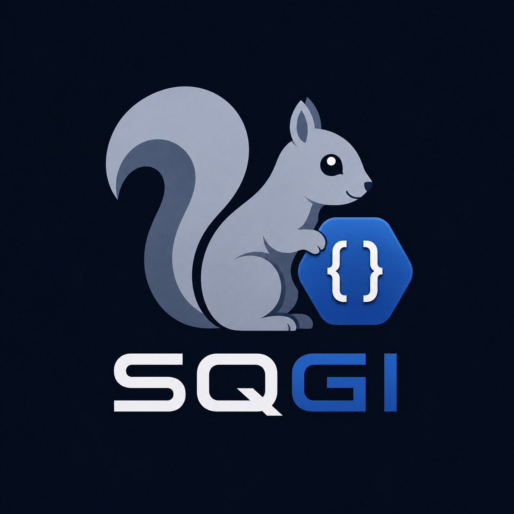

# SQGI

<p align="center">
  
</p>

<p align="center">
  <strong>Native applications in Squirrel. Direct GI bindings. Modern async. LLVM acceleration. One-command packaging.</strong>
</p>

SQGI is a compact native application runtime built around **Squirrel**, **GLib**, and
**GObject Introspection**.

It lets you write high-level scripts that call real native libraries directly:
GTK 4, Gio, GStreamer, libsoup, GdkPixbuf, Cairo, and any other library that
publishes GI metadata. There is no generated binding layer for every API.

When ordinary scripting is not fast enough, SQGI provides an **LLVM JIT** for
eligible Squirrel code and **typed LLVM kernels** for compute-heavy hot paths.
When the application is ready to ship, `sqgipkg` can turn it into Linux
AppImages and Windows installers with the runtime and native dependencies
bundled alongside it.

The idea is simple:

> **Keep scripting pleasant, stay close to the native platform, make hot code
> fast, and treat deployment as part of the development workflow.**

[Documentation](https://sqgi.readthedocs.io/en/latest/) ·
[Discord](https://discord.gg/krVe8U9wGm)

---

## Why SQGI?

SQGI sits between heavyweight application platforms and writing an entire
application in C or C++.

- **Native APIs without hand-written bindings** — import GI namespaces directly.
- **Small dynamic language** — Squirrel provides closures, classes, exceptions,
  modules, tables, arrays, 64-bit integers, and double-precision floats.
- **Modern async** — native Gio-style async APIs integrate with `async` / `await`.
- **Native-speed hot paths** — the LLVM JIT accelerates eligible Squirrel
  code, while typed kernels provide a predictable high-performance compute path.
- **Static analysis** — `sqgicheck` catches definite Squirrel/GI mistakes without
  executing the application.
- **Native extensions stay native** — expose C, C++, or Vala code through
  GObject Introspection and import it like any other library.
- **Embeddable** — use SQGI as an interpreter or embed it into a native program.
- **Deployment is built in** — package scripts, typelibs, native libraries,
  plugins, themes, runtime data, AppImages, and Windows NSIS installers with
  `sqgipkg`.

SQGI is a good fit for desktop tools, media software, engineering applications,
scientific utilities, hardware front ends, automation, networking tools, and
scriptable native applications.

---

## A 60-second example

Save this as `hello.nut`, then run `sqgi hello.nut README.md` from the repository
root. This is ordinary Squirrel calling a native Gio async API:

```squirrel
#!/usr/bin/env sqgi

local GLib = import("GLib")
local Gio  = import("Gio")

local loop = GLib.MainLoop.new(null, false)
local path = vargv.len() > 0 ? vargv[0] : "README.md"

async function main() {
    local file = Gio.File.new_for_path(path)
    local result = await file.load_contents_async(null)

    print(result[0])

    loop.quit()
}

main().catch(function(e) {
    print("error: " + e + "\n")
    loop.quit()
})

loop.run()
```

There is no generated Gio wrapper here. SQGI reads GI metadata at runtime,
marshals the call, and exposes the native async operation as an awaitable method.

---

## Native GTK applications

```squirrel
#!/usr/bin/env sqgi

local Gtk = import("Gtk", "4.0")

local app = Gtk.Application.new("org.example.sqgi.hello", 0)

app.connect("activate", function() {
    local win = Gtk.ApplicationWindow.new(app)
    win.title = "Hello SQGI"
    win.set_default_size(420, 220)

    local button = Gtk.Button.new_with_label("Hello from SQGI")

    button.connect("clicked", function() {
        print("clicked\n")
    })

    win.set_child(button)
    win.present()
})

app.run(0, null)
```

This creates a native GTK window directly from Squirrel through GObject
Introspection.

---

## Performance

**Fast scripting, with hot paths that match native C++.**

In the benchmarks below, SQGI's vector kernel runs **13.4× faster than Node.js
and matches optimized C++**. Ordinary Squirrel JIT code delivers **4.7× faster
dynamic member operations than Node.js**.

SQGI has two complementary high-performance execution paths.

### LLVM JIT for ordinary Squirrel

Eligible hot Squirrel functions and loops can be compiled through LLVM. The JIT
retains Squirrel's dynamic behavior with guards and interpreter fallback when an
optimization does not apply.

Numeric loops and repeated object operations run as native code while the rest
of the application keeps Squirrel’s dynamic APIs and GI integration.

### Typed kernels

For code where explicit types and predictable native execution are desirable,
SQGI also provides a small typed kernel language with:

- functions
- structs
- typed classes
- fixed-size local arrays and runtime-sized array parameters
- branches and loops
- math intrinsics
- native LLVM code generation

Kernels are called from Squirrel through `sqgi.kernel` and work independently of
the ordinary bytecode JIT.

### Selected benchmark results

**Nanoseconds per loop iteration; lower is better.**

Five-round medians on an Intel i7-12700 running Linux x86-64, compared with
Node.js 26.9.0 and optimized native C++.

| SQGI execution | Workload | SQGI | Node.js | Native C++ |
|---|---|---:|---:|---:|
| Ordinary Squirrel JIT | Direct function call | 3.156 | 4.003 | 3.776 |
| Ordinary Squirrel JIT | Branching function call | 3.223 | 3.022 | 2.703 |
| Ordinary Squirrel JIT | Dynamic member operations | 6.025 | 28.056 | 26.930 |
| Typed kernel | Vector recurrence | 8.425 | 112.542 | 8.485 |
| Typed kernel | Matrix recurrence | 7.025 | 8.615 | 5.670 |

<details>
<summary><strong>Benchmark methodology</strong></summary>

These are warm microbenchmarks; application performance depends on the workload,
data representation, and batching. Measurements were taken on 2026-09-18 with:

- one pinned CPU
- five warmups
- JIT threshold of one
- compilation excluded from timed regions
- checksums matched across runtimes
- no LTO or PGO
- GCC 13.3.0 for C++
- `-O3 -march=native -fno-fast-math -ffp-contract=off`

Kernel SQGI/Node timings come from dedicated comparisons with a complete loop
inside each kernel call. The vector kernel uses fixed storage while the Node.js
version uses objects. The native C++ comparison uses typed fields and fixed
arrays, with `std::unordered_map` for dynamic string-key workloads.

Raw data and reproduction material:

- [JIT / native comparison](docs/benchmark-results/readme-native-comparison-2026-09-18.json)
- [Vector comparison](docs/benchmark-results/llvm-kernel-vector-2026-09-18.json)
- [Matrix comparison](docs/benchmark-results/llvm-kernel-matrix-2026-09-18.json)
- [Full kernel benchmark suite](demo/benchmarks/kernels/README.md)

</details>

### Build with LLVM

The LLVM JIT and typed kernel compiler are included in the default build.
JIT execution is enabled without environment settings. Applications can use
ordinary Squirrel, typed kernels, or both.

Install the normal build dependencies plus LLVM 18 development headers and the
matching LLVM library, then build with:

```sh
cmake -S . -B build -DCMAKE_BUILD_TYPE=Release

cmake --build build -j"$(nproc)"
```

Run a kernel demo:

```sh
build/sqgi demo/kernels/geometry.nut
```

See [docs/kernels/README.md](docs/kernels/README.md) for the kernel language,
Squirrel API, platform support, deployment requirements, and more examples.

---

## Native libraries, directly

Any installed introspected namespace can be imported at runtime:

```squirrel
local GLib   = import("GLib")
local Gio    = import("Gio")
local Gtk    = import("Gtk", "4.0")
local Gst    = import("Gst")
local Soup   = import("Soup")
local Pixbuf = import("GdkPixbuf")
```

SQGI handles common GI shapes including:

- functions and methods
- constructors
- properties
- signals
- callbacks
- out parameters
- `GError`
- `GValue`
- `GVariant`
- byte arrays
- boxed values
- native ownership conventions

That means a large native API surface becomes available without maintaining a
separate language binding for every library version.

---

## Async / await

Gio-style `_async` / `_finish` API pairs are exposed as awaitable methods.

```squirrel
local Gio = import("Gio")

async function read_text(path) {
    local file = Gio.File.new_for_path(path)
    local result = await file.load_contents_async(null)
    return result[0]
}
```

Inside an async function, `sqgi.all` waits for several tasks together:

```squirrel
async function read_project_files() {
    return await sqgi.all([
        read_text("README.md"),
        read_text("LICENSE")
    ])
}
```

Other helpers include `sqgi.sleep`, `sqgi.race`, and `.then()` / `.catch()`
chaining.

---

## Editor support

Syntax highlighting for `.nut` scripts and `.sqk` kernels is included for
**VS Code, Vim, and GtkSourceView**.

- **VS Code:** highlighting, bracket matching, document formatting, and
  format-on-save. The formatter runs inside the extension.
- **Vim:** a native syntax package covering SQGI Squirrel and typed kernels.
- **GtkSourceView 4/5:** language definitions plus an async formatting adapter
  and a runnable GTK editor demo.
- **`sqgifmt`:** the shared formatter for the command line and CI.

See the [editor setup guide](editors/README.md) for installation, VS Code
format-on-save settings, Vim setup, and GtkSourceView integration. The VS Code
extension is currently installed from a locally built VSIX.

---

## Static analysis with `sqgicheck`

`sqgicheck` checks SQGI source **without executing it**.

It compiles the source with SQGI's bundled Squirrel compiler and abstractly
interprets the resulting bytecode against the same GI metadata used by the
runtime.

For example:

```text
main.nut:8:6: error SQGI102: Gio.File has no method 'get_paht'
  help: did you mean 'get_path'?
```

Run it directly:

```sh
sqgicheck main.nut
sqgicheck --summary main.nut
sqgicheck --format=json main.nut
```

Literal local imports such as `import("lib/helpers.nut")` are checked
recursively by default, and statically known exports can flow into their
importers.

A clean check exits with status `0`; diagnostics exit with `1`; invalid CLI
usage exits with `2`, making the same tool suitable for local development and
CI.

See [docs/sqgicheck.md](docs/sqgicheck.md) for the complete guide.

---

## Packaging: from source tree to distributable app

To create or edit the manifest with guided forms, launch **SQGI Manifest Studio**:

```bash
tools/sqgipkg-gui                 # source checkout; uses build/sqgi
sqgipkg-gui path/to/sqgipkg.json   # after installation
```

The GTK 4 editor saves ordinary manifests and calls `sqgipkg` for Check/Explain.
Run `sqgipkg` to produce packages. See the [editor guide and requirements](tools/sqgipkg_gui/README.md).

`sqgipkg` is part of SQGI rather than an unrelated deployment system bolted on
later.

From a directory containing `main.nut`:

```sh
sqgipkg
```

On Linux the default output is an AppImage. On Windows the default is an NSIS
installer.

Start a manifest when you need more control:

```sh
sqgipkg --init gtk4
sqgipkg --doctor
```

Useful targets include:

```sh
sqgipkg --target appimage
sqgipkg --target linux-sysroot
sqgipkg --target win-dir
sqgipkg --target win-nsis
sqgipkg --target win-sysroot
sqgipkg --target all
```

A project configured for Linux `x86_64` and `aarch64` plus Windows can use:

```sh
sqgipkg --target all
```

to produce a release set along the lines of:

```text
dist-linux-x86_64/MyApp.AppImage
dist-linux-aarch64/MyApp.AppImage
dist-windows-x86_64/MyApp-Setup.exe
```

### What gets bundled?

Depending on the manifest, `sqgipkg` can stage and resolve:

- Squirrel scripts compiled to `.cnut` bytecode
- script import paths
- application resources
- native `.so` / `.dll` libraries
- GI typelibs
- GStreamer plugins
- GTK themes, icons, settings, and runtime data
- GSettings schemas
- GIO modules
- gdk-pixbuf loaders
- Debian/Ubuntu packages into private Linux sysroots
- Windows MSYS2 packages
- recursive Windows DLL dependency closure
- generated Linux and Windows launchers
- AppImages
- NSIS installers

Linux dependency sysroots can be isolated from the build host, and Windows
cross-builds can prepare an MSYS2-style dependency tree and recursively gather
the DLLs the final application needs.

Cross-architecture AppImage smoke tests can use QEMU user-mode/binfmt when the
matching emulator and target sysroot are available.

See:

- [Packaging tutorials](docs/packaging/)
- [Simple manifest guide](docs/packaging/10-simple-manifests.md)
- [Packaging reference](tools/README.md)

---

## Quick start

### Windows: Ooblerg

The easiest way to try SQGI on Windows is through
[Ooblerg](https://ooblerg.xyz/).

1. Install Ooblerg.
2. Install `sqgi`.
3. Install any native libraries your app needs, such as `gtk4`, `gstreamer`,
   `libsoup`, or `gdk-pixbuf`.
4. Open a terminal after Ooblerg updates your `PATH`.
5. Write a `.nut` file.
6. Run it with `sqgi`.

```bat
sqgi hello.nut
```

### Linux: build from source

On Ubuntu/Debian-style systems:

```sh
git clone https://github.com/supercamel/sqgi.git
cd sqgi

sudo apt install cmake build-essential pkg-config \
  libglib2.0-dev libgirepository1.0-dev libffi-dev libcairo2-dev llvm-18-dev

cmake -S . -B build -DCMAKE_BUILD_TYPE=Release
cmake --build build -j"$(nproc)"

build/sqgi --version
build/sqgi demo/gio/file_read.nut README.md
build/sqgicheck demo/gio/file_read.nut
```

Default CMake builds include the LLVM JIT and typed kernels, using LLVM 18
headers and its matching library. JIT execution is enabled without environment
settings. Set `SQGI_JIT=0` when running a script to use the interpreter for
ordinary Squirrel; typed kernels remain available.

Install system-wide:

```sh
sudo cmake --install build --prefix /usr/local
```

### Optional: build from source with MSYS2

This source-build route uses a MinGW-style shell such as UCRT64 or MINGW64.
Running SQGI or a packaged Windows application does not require an MSYS2 shell.

The helper script installs the matching compiler, CMake, Ninja, and GLib/GI
dependencies, then builds and installs LLVM 18.1.8 for that toolchain. The first
run downloads LLVM's pinned source archive and compiles its native backend;
subsequent runs reuse the `build-llvm18-<target>` build directory. Set
`CMAKE_BUILD_PARALLEL_LEVEL` to limit build concurrency on machines with less RAM.

```sh
./tools/install-msys2-prereqs.sh ucrt64

cmake -S . -B build-ucrt64 -G Ninja \
  -DCMAKE_BUILD_TYPE=Release \
  -DCMAKE_INSTALL_PREFIX=/ucrt64

cmake --build build-ucrt64
cmake --install build-ucrt64
```

The install includes the interpreter, packaging tool, static checker, embeddable
library, headers, `pkg-config` metadata, and packaging runtime/templates.

---

## Native extensions

If native code publishes GObject Introspection metadata, SQGI can call it.

A native extension might produce:

```text
native/build/libmyapp-1.0.so
native/build/MyApp-1.0.typelib
```

Then Squirrel can import it normally:

```squirrel
local MyApp = import("MyApp", "1.0")

local worker = MyApp.Worker.new()
print(worker.do_native_work("hello") + "\n")
```

This works with hand-written C/C++ GObject libraries and Vala libraries. Vala
async methods can be awaited directly when exposed through GI.

Working examples:

```text
tools/sqgipkg_tests/native_gi_project/
tools/sqgipkg_tests/native_vala_project/
```

---

## Embed SQGI in a native application

SQGI can also run inside an existing native program.

Compile against the installed library with `pkg-config`:

```sh
gcc myapp.c $(pkg-config --cflags --libs sqgi)
```

The public C entry point is
[`src/sqgi_vm.h`](src/sqgi_vm.h). Installed headers live under
`include/sqgi/`.

`sqgipkg` can package native executable entrypoints too, so a C/C++/Vala
application can embed SQGI internally while still using the same packaging
machinery for scripts, resources, typelibs, GTK data, and native dependencies.

---

## What can you build?

A few natural fits:

- GTK 4 desktop applications
- engineering and scientific tools
- compute-heavy native utilities with typed kernels
- media players, capture tools, overlays, and GStreamer experiments
- HTTP clients, API tools, and local services
- image and graphics utilities with GdkPixbuf and Cairo
- filesystem, process, and networking tools with Gio
- hardware and embedded-system front ends
- automation that needs native OS integration
- scriptable applications with a C/C++/Vala core
- portable utilities distributed as AppImages or Windows installers

SQGI is deliberately not limited to GUI applications. GTK is one useful part of
the GI ecosystem; Gio, GStreamer, libsoup, Cairo, and custom introspected native
libraries are equally valid building blocks.

---

## Documentation and examples

| You want to... | Go here |
|---|---|
| Learn the language as SQGI uses it | [docs/language/](docs/language/) |
| Look up SQGI runtime APIs | [docs/api/README.md](docs/api/README.md) |
| Follow library-specific recipes | [docs/recipes/](docs/recipes/) |
| Browse runnable examples | [demo/](demo/) |
| Set up highlighting and formatting | [editors/README.md](editors/README.md) |
| Learn typed kernels and LLVM support | [docs/kernels/README.md](docs/kernels/README.md) |
| Inspect kernel benchmarks | [demo/benchmarks/kernels/README.md](demo/benchmarks/kernels/README.md) |
| Learn packaging step by step | [docs/packaging/](docs/packaging/) |
| Look up packaging fields and targets | [tools/README.md](tools/README.md) |
| Learn `sqgicheck` | [docs/sqgicheck.md](docs/sqgicheck.md) |

The demos cover GLib, Gio, GTK 4, GStreamer, libsoup, GdkPixbuf, Cairo,
packaging, native executable entrypoints, native GI extension projects, and LLVM
kernels.

---

## Under the hood

The runtime is intentionally understandable. Core pieces are split across a
small set of C modules:

```text
src/
  main.c             CLI entry point and REPL
  sqgi_vm.c          VM setup and standard library wiring
  sqgi_import.c      import("Module") for typelibs and .nut files
  sqgi_gi.c          GIRepository function dispatch
  sqgi_gi_object.c   object wrappers, properties, async wrappers
  sqgi_marshal.c     GIArgument / GValue / GVariant conversion
  sqgi_signal.c      GObject signals with cross-thread dispatch
  sqgi_async.c       Task runtime and async/await support
  sqgi_subclass.c    GType registration and vfunc overrides
  sqgi_cairo.c       Cairo Context / Surface / Pattern bridge
  sqgi_json.c        dependency-free JSON codec
```

GObject Introspection metadata and libffi closures provide broad access to native
libraries without a generated binding layer for each API.

LLVM accelerates eligible Squirrel code and compiles typed kernels. The
interpreter handles the remaining dynamic Squirrel code.

---

## Development

Run the main runtime/script test suite:

```sh
./test/run_tests.sh
```

Run CTest:

```sh
ctest --test-dir build --output-on-failure
```

AddressSanitizer build:

```sh
cmake -S . -B build-asan -DSQGI_ENABLE_ASAN=ON
cmake --build build-asan -j"$(nproc)"
```

Packaging tests:

```sh
bash tools/sqgipkg_tests/run_tests.sh build/sqgi
```

Static-analysis tests:

```sh
ctest --test-dir build -R sqgicheck --output-on-failure
```

---

## Project status

SQGI is a **working technology preview**.

It already has broad test coverage across marshalling, async, signals, GObject
properties, subclassing, `GVariant` / `GValue`, JSON, Cairo, packaging, static
analysis, and real native-library demos.

The project is still young. Unusual GI metadata shapes, platform-specific native
libraries, and the experimental LLVM paths may expose bugs.

Small reproducible bug reports, focused test cases, benchmark contributions, and
real-world examples are welcome.

---

## License

SQGI is released under the [MIT License](LICENSE).

The Squirrel sources under `Squirrel3/` retain their upstream copyright.
