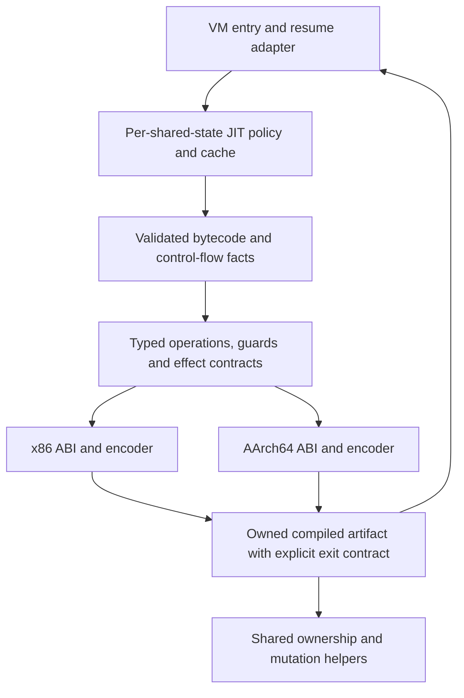

# JIT architecture review — 7 September 2026

The JIT needs architectural refactoring. Its main maintenance cost is that
bytecode meaning, speculative state, native calling conventions and fallback
correctness are intertwined and partly implemented four times. File size makes
that harder to inspect, but reducing file size alone will not resolve it.

The useful foundation should be retained: optional compilation, interpreter
fallback, a bounded instruction budget, executable-memory protection, focused
numeric fast paths, and behavior/rollback tests. The evidence supports an
incremental refactor that establishes common correctness contracts before
sharing compiler implementation.

This review covers the current working tree, including the preceding audit's
x86 correctness fixes. It makes no further runtime changes. Native verification
and measurements were performed on Linux x86-64; AArch64 and Windows findings
are based on source inspection and existing tests/documentation.

## Current structure

The JIT directory contains 19,525 lines, including headers, comments and blanks.

| Component | Size | Responsibilities actually present |
| --- | ---: | --- |
| `sqjit.cpp` | 6,658 lines | Environment/configuration, statistics, hotness/backoff, special-purpose accessor/setter/numeric compilation, x86 encoding, runtime helpers, write logs, function and loop compilers, code allocation and execution |
| AArch64 whole-function fragment | 4,404 lines | Analysis, observed types, constants, constructors, inlining, prepared calls, lowering, instruction emission and exits |
| AArch64 loop fragment | 4,587 lines | Operand-use analysis, region discovery, liveness, loop optimizations, observed shapes, lowering, emission, writeback and rollback |
| AArch64 helper fragment | 2,481 lines | Language/runtime operations, ownership helpers, write logging, specialization inspection and supporting emission |
| AArch64 private header | 531 lines | Slot state, prepared-call state, write-log structures, limits and other backend details |
| AArch64 encoder | 333 lines plus 74-line header | Encodings, relocations, ABI prologue/epilogue, and some VM-layout-aware guards |

The main AArch64 function compiler is approximately 4,377 lines long. The loop
compiler begins at line 313 of its fragment and occupies approximately 4,275
lines. The fragments contain 93 and 85 local lambdas respectively, including
nested lambdas. Many capture the surrounding compiler state by reference.

VM integration has three execution routes:

1. Compile/execute a function after normal VM frame setup.
2. Invoke an already compiled closure directly at `_OP_CALL`, before normal
   frame setup.
3. Enter a compiled loop from `_OP_JCMP` or `_OP_JZ` and update the interpreter IP
   on successful exit.

Before either machine backend, common code also recognizes particular bytecode
patterns and replaces them with C++ accessor, setter or numeric entry stubs.
Thus a reported native entry is not necessarily newly emitted machine code.
That is a reasonable optimization, but should be explicit in diagnostics and
compiled-artifact types.

## Findings, in priority order

### 1. Correctness rules are duplicated across architecture and compilation mode

The x86 whole-function and loop compilers each maintain parallel arrays for slot
kind, materialization, constants and object locations. Loop mode adds its own
dirty and entry-loaded tracking. AArch64 has a better `SQJitA64SlotState`, but
its state and transition machinery are private to that backend, and each
compiler still separately manages prepared calls and additional observations.

Instruction read/write analysis is duplicated too. For example, x86's
`sqjit_loop_instruction_writes_slot` and AArch64's corresponding helper both
encode bytecode operand semantics. Loop live-out analysis scans instructions
linearly; neither implementation is a reusable control-flow analysis with
explicit block-entry and block-exit facts.

This is already a correctness cost, not just a style concern. The preceding
audit repaired an x86 loop-index constant bug and reference-losing loop
writeback. AArch64 already had reference-aware scalar-store helpers, illustrating
how one architecture can learn a rule without the other acquiring it. The
recent x86 backedge invalidation patch is an appropriate local correction, but
its instruction scanning is another rule that a future opcode change must
remember to preserve.

**Recommendation:** introduce shared bytecode validation/use-def information and
control-flow analysis. Define a common semantic slot state, distinct from each
backend's physical registers and spill locations. Merge constant/type facts at
control-flow joins and calculate live-out values explicitly. Share these rules
before trying to merge entire compilers.

Evidence: `sqjit.cpp:2429`, `sqjit.cpp:3166`, `sqjit.cpp:3786`,
`sqjit.cpp:3953`, `sqjit_backend_aarch64_private.h:43`,
`sqjit_backend_aarch64_compile_loop.inc:1`.

### 2. Fallback is an implicit transaction spanning several subsystems

The backend status enum has two values: guard failure and successful return.
Compiled code can mutate arrays/members, record previous values, and roll those
mutations back before the interpreter retries. Loop success additionally writes
native locals back into Squirrel slots and supplies a next IP.

Correctness depends on agreements distributed among opcode emitters, runtime
helpers, native epilogues, slot flags, object lifetime management and the VM
caller. The type system does not describe whether an operation can allocate,
release an object, invoke script, invalidate an observation, or leave an effect
that cannot be replayed.

The write-log implementations have already diverged. AArch64 deduplicates
repeated array writes to retain the original value once, whereas x86 appends a
log entry for each write. Both approaches can implement rollback, but their
memory and performance behavior differs. Language-level ownership and rollback
semantics should not be independently maintained in instruction-set backends.

**Recommendation:** specify and test the existing contract first:

- A rejected compilation publishes no partially constructed artifact.
- A guard failure returns to a defined restart point with replay-safe state.
- A successful loop exit materializes every required value using correct
  reference semantics and provides a valid continuation IP.
- Every helper declares its effects and invalidations. Operations with
  unhandled effects must be rejected before they become observable.

Extract shared ownership and transaction helpers. Use typed compile results and
an explicit execution-exit record. Initially preserve today's entry replay
behavior; arbitrary mid-function deoptimization would be a separate feature
with substantially larger requirements.

Evidence: `sqjit_backend.h:13`, `sqjit.cpp:1866`, `sqjit.cpp:1907`,
`sqjit.cpp:5100`, `sqjit.cpp:6514`,
`sqjit_backend_aarch64_helpers.inc:659`,
`sqjit_backend_aarch64_compile_loop.inc:4474`.

### 3. The file split did not create compiler boundaries

The AArch64 root includes helper, function and loop `.inc` files into one
translation unit. These pieces share static declarations and ordering; for
example, supporting code defined in the function fragment is available to the
later loop fragment. The split makes navigation easier but does not permit
isolated compilation or unit testing of most compiler decisions.

Meanwhile x86 encoding, compiler logic, allocator and generic JIT management
remain in `sqjit.cpp`. The nominal backend interface exposes entire Squirrel
prototypes, live entry stacks, closures and mutable runtime metadata. Each
backend consequently owns both semantic decisions and machine emission.

**Recommendation:** extract real modules with narrow inputs and outputs. Use
compiler context objects with named responsibilities; moving all current lambda
captures into a single enormous class would preserve the same coupling. Retain
separate function-entry and loop-entry drivers, while sharing analysis, helper
contracts and eventually typed lowering operations.

Evidence: `sqjit_backend_aarch64.cpp:228`,
`sqjit_backend_aarch64.cpp:296`, `sqjit_backend.h:83`,
`sqjit_backend_aarch64_compile_proto.inc:4392`.

### 4. Ownership, policy and backend selection need explicit owners

`SQJitProto::_entry` is a `void *` pointing to metadata, while `_loop_entry` is a
`void *` pointing to executable code. `SQJitNative` mixes a machine-code pointer,
allocation size and fields for several different specialized C++ stub shapes.
Initialization and teardown are manual. The function prototype also contains a
JIT-dependent field in the middle of its layout, which caused the previously
fixed checker/runtime layout mismatch.

Configuration, diagnostics, transient-rejection state and backoff clocks are
process globals. In particular, transient rejection is consumed as a side
channel after trying multiple compilation strategies. This makes isolated
testing and multiple shared states harder to reason about. It is an ownership
and testability finding, not a claim that a concurrent JIT crash was reproduced.

Backend availability is expressed separately in CMake and C++. CMake marks a
native x86 backend available only on UNIX, while `sqjit.cpp` contains a Windows
x64 native path. Therefore the build's capability message/test selection and
the source's capability selection can disagree.

**Recommendation:** use a context owned by `SQSharedState`, typed compiled
function/loop records, and an executable-code owner with deterministic cleanup.
Have compile attempts return their rejection/retry classification directly.
Centralize platform capability selection and propagate the internal build
configuration consistently to every consumer of Squirrel's private headers.
Keep configuration and instrumentation out of the encoding layer.

Evidence: `sqjit.h:30`, `sqjit_backend.h:62`, `sqjit.cpp:43`,
`sqjit.cpp:161`, `sqjit.cpp:6130`, `sqjit.cpp:6638`,
`sqfuncproto.h:186`, repository `CMakeLists.txt:35`.

### 5. Tests verify results more strongly than execution routes

The script suite includes valuable rollback, shape-change, object-lifetime and
fallback cases. All ten JIT-labeled CTests passed in the fresh Release build.
However, most cases can also pass by falling back to the interpreter.

The two CMake native-execution regex checks both name
`numeric_variant_kernel`. They prove that kernel executed natively, not that
every mutation, constructor, inline call or fallback assertion exercised the
intended compilation route. AArch64 has encoding and invalid-operand native
tests; x86 lacks equivalent standalone encoder tests. Even encoding-only
AArch64 tests are currently gated on an AArch64 host.

Diagnostics do not close this gap. On the x86 correctness script the statistics
reported:

```text
function compilations: 91 attempts, 34 successes, 57 failures
loop compilations:    31 attempts,  5 successes, 26 failures
rejections:            0; unique reasons: 0
```

The x86 compiler mostly returns plain `false`; it does not call the rejection
recorder. The purported stable rejection category is also inferred from message
substrings, rather than passed as a category by the compiler.

**Recommendation:** add test-facing structured records for compilation result,
backend, function-versus-loop execution, guard failure and rollback. Assert the
intended route for each regression as well as its result. Pass typed rejection
codes at their origin. Make pure encoders testable on any build host, reserving
actual instruction execution/ABI verification for native architecture lanes.

Evidence: repository `CMakeLists.txt:478`,
`test/test_jit_correctness.nut:849`, `sqjit.cpp:190`,
`sqjit.cpp:601`, `sqjit_backend_aarch64_emit.cpp:7`.

### 6. Existing design documents describe both intent and history

The design document proposes interpreter-stack-based execution, explicit resume
points and a per-shared-state context. The current implementation instead has
substantial local native state, transaction/replay behavior and process-global
policy. Its architecture section describes `sqjit.cpp` as manager/policy code,
which materially understates its current responsibilities.

The maintainability checklist accurately records useful AArch64 cleanup, but
also marks the generic-IR deferral and duplication review complete. Those were
reasonable decisions for that pass. They should not be treated as evidence that
the architectural issues are resolved. Its historical benchmark matrix is
AArch64-specific and should not imply identical x86 capability or value.

Update these documents to distinguish implemented contracts, historical work,
and future design. Retain the existing benchmark and rollback gates.

## Performance evidence for scope decisions

Fresh Release build, GCC 13.3, Linux x86-64, Intel Core i7-12700. Measured using
the repository's median runner with five runs, 8,000 iterations and hotness
threshold 1. No runtime code changed during this review.

| Benchmark | JIT off, µs | JIT on, µs | Off/on speedup |
| --- | ---: | ---: | ---: |
| numeric_loop | 0.033906 | 0.010244 | 3.310× |
| direct_call | 0.063425 | 0.034913 | 1.817× |
| array_append | 0.061625 | 0.036500 | 1.688× |
| array_write | 0.030250 | 0.039000 | 0.776× |
| dynamic_key_get_set | 0.062500 | 0.064750 | 0.965× |
| dynamic_member | 0.258375 | 0.259125 | 0.997× |
| math_intrinsic | 0.282375 | 0.279500 | 1.010× |
| matrix | 0.430250 | 0.432625 | 0.995× |
| vector | 2.739375 | 2.737000 | 1.001× |
| object_member_write_fallback | 0.184125 | 0.184375 | 0.999× |

These are local directional measurements, not universal performance claims.
The harness permits fallback, so a parity result does not by itself show an
active fast path is ineffective. The array-write result deserves examination
alongside x86's repeated-write log growth and the recent correctness repairs;
this review did not isolate their individual performance costs.

Preserve numeric loops, direct calls and measured array wins while refactoring.
Freeze expansion of marginal paths until route-specific measurements demonstrate
their value. Re-measure AArch64 before making cross-platform pruning decisions.

## Recommended target boundaries



The shared representation can start as a compact validated compilation plan:
blocks, slot facts, guards, operations and exit materialization requirements.
It does not need SSA, a general optimizer, or a new compiler dependency to make
the current rules explicit. Backend-specific register allocation and ABI
details remain backend-specific. Function returns and loop continuation have
distinct entry/exit contracts even when they share arithmetic lowering.

Suggested responsibilities:

| Module | Owns | Must not own |
| --- | --- | --- |
| Context/manager | Hotness, retry/backoff policy, artifact lifetime, diagnostics | Instruction encodings or opcode lowering |
| Analysis | Operand validation, block edges, use/def, joins, liveness | Registers or executable memory |
| Lowering | Supported typed operations, guards, helper effects, exit requirements | OS memory calls or raw VM-frame teardown |
| Runtime helpers | Reference semantics, checked object operations, rollback | Architecture-specific register conventions |
| Backend/ABI | Registers, spills, calls, encodings and relocations | Independent definitions of Squirrel semantics |
| VM adapter | Frame entry, successful returns, loop continuation, fallback | Compilation policy internals |

## Incremental implementation sequence

1. **Establish execution contracts and test observability.** Add structured
   compilation/execution outcomes and route assertions for existing regressions.
   Preserve the current fallback behavior. Record per-architecture baselines.
   This makes later coverage losses visible instead of allowing fallback to
   conceal them.
2. **Extract existing components without redesigning algorithms.** Move x86
   encoding/ABI/code allocation out of `sqjit.cpp`; extract configuration,
   diagnostics and special-purpose C++ stubs. Introduce typed artifact owners
   and shared-state context. Make byte-encoding tests portable. Keep code moves
   and behavior changes in separate commits.
3. **Centralize correctness rules.** Add common operand/flow analysis, slot
   invariants, ownership helpers and a tested write-log contract. Migrate one
   rule at a time. Keep raw scalar stores only where freshness/scalar safety
   has an explicit proof or runtime guard.
4. **Introduce shared lowering incrementally.** Start with numeric operations
   and array reads, then logged writes. Keep function/loop drivers separate.
   Replace backend-specific semantic decisions only when both backends consume
   the same tested plan. Remove each displaced implementation as it migrates.
5. **Prune and tune using the new observability.** Review constructors,
   dynamic members, special accessor/setter recognizers and inline-call shapes
   against measured workloads. Share, retain or remove individual paths based
   on their value and ownership obligations. Revisit code-cache and multi-loop
   policy only when workloads justify it.

The first implementation should stop after steps 1–2 and review the resulting
boundaries before undertaking shared lowering. That gives an independently
useful improvement and avoids turning a maintainability refactor into a
simultaneous rewrite of every execution path.

Acceptance criteria for the overall work:

- Changing a bytecode's operand effects or reference rule has one authoritative
  implementation and direct tests.
- A backend's decision to reject is visible and testable.
- Mutating regression tests prove successful native execution and late guard
  failure with correct rollback, including aliasing and repeated writes.
- Functions and loops can be tested independently; two live shared states do
  not share compilation policy or transient failure state.
- Both encoders have portable byte-level tests; both supported architectures
  have native execution/ABI tests.
- Whole-function and loop drivers primarily coordinate named components, rather
  than containing dozens of capture-all emission lambdas.
- Interpreter behavior, sanitizer results and the benchmark-owned wins remain
  stable through the migration.

## Verification artifacts

```sh
cmake -S . -B /tmp/sqgi-jit-review-20260907/release -G Ninja \
  -DCMAKE_BUILD_TYPE=Release -DSQ_ENABLE_JIT=ON
cmake --build /tmp/sqgi-jit-review-20260907/release --target sqgi-bin -j 6
ctest --test-dir /tmp/sqgi-jit-review-20260907/release -L jit --output-on-failure
python3 tools/run_jit_median_benchmarks.py \
  --sqgi /tmp/sqgi-jit-review-20260907/release/sqgi --runs 5 8000
python3 tools/run_jit_reject_summary.py test/test_jit_correctness.nut \
  --sqgi /tmp/sqgi-jit-review-20260907/release/sqgi
```

Local logs: `/tmp/sqgi-jit-review-tests.log`,
`/tmp/sqgi-jit-review-medians.log`, `/tmp/sqgi-jit-review-rejections.log`,
and `/tmp/sqgi-jit-review-native-paths.log`.
