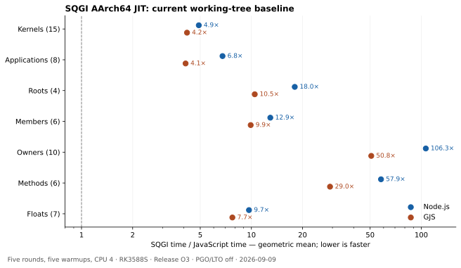

# SQGI JIT performance audit — 2026-09-09

The current AArch64 working tree takes **15.36× Node.js's time and 10.13× GJS's time** across 56 equally weighted benchmark components. Ownership and mutating-method workloads dominate the gap. The ownership suite is **2.92× slower with JIT enabled than with the interpreter**, despite successful native execution. Native coverage is the other major problem: the member suite spends 70% of sampled cycles in the VM.

This is a measured starting point for the requested iterative performance goal, not an accepted optimization. No runtime source was changed during this audit. The preexisting uncommitted work is preserved.

## Baseline and measurement

- RK3588S, native AArch64, pinned CPU 4, ondemand governor, maximum 2.304 GHz. Ordinary workstation activity was not stopped. Thermal readings during the sweep were approximately 69–70°C.
- GCC 13.3 Release, `-O3 -DNDEBUG -g`, native JIT enabled, int64/double, PGO and LTO disabled. `SQGI_JIT=1`, threshold 1, diagnostic tracing disabled for timing.
- Node.js **v18.19.1** and GJS **1.80.2**. GJS uses module mode. These results describe those installed versions, not a claim about every version or platform.
- Five fresh-process rounds, five full warmups, rotating runtime order, medians, and independent JIT-off checksum references. There are 180 accepted timed runtime processes across the comparison runs, including the Python controls in the existing runtime runner.
- The 15 kernels use 160,000 base iterations, with the suite's original 20× multiplier for six scalar kernels. The other suites use 200,000 iterations. Applications are repeated at seed 83 / 400,003 iterations, in addition to seed 17 / 200,000.
- Node and GJS run the existing JavaScript algorithms. The four Node-only holdout ports receive a GJS adapter for arguments, the monotonic clock, and stdout; their algorithm bodies are unchanged. The adapter and its hash are saved.
- Integer results are checked exactly by the existing cross-runtime runner, with its tight tolerance for designated floating kernels. The four adapted holdout suites require exact final numeric checksum agreement. Every accepted timing run passes its checks.

Timings cover warmed workload execution, including allocations within each workload, but exclude process startup. They are component benchmarks, not complete application latency or GI throughput. The vector ports use SQGI operators and JavaScript methods, as documented by the original suite. The second application seed is a robustness check and is not counted again in the 56-component aggregate.

[Provenance](jit-performance-audit-2026-09-09/provenance.json), [all component medians and spreads](jit-performance-audit-2026-09-09/tables.md), and [machine-readable summary](jit-performance-audit-2026-09-09/summary.json).

## Cross-runtime results

Ratios are SQGI time divided by the comparison runtime's time; lower is better. Each suite row is a geometric mean. The committed column is the preserved ordinary Release binary from `953b5b4`, not the installed `/usr/local/bin/sqgi` and not a freshly trained PGO build. That historical binary predates the added ownership regressions and must not be treated as a correctness-approved replacement.

| Suite | Cases | / Node.js | / GJS | / committed SQGI |
| --- | ---: | ---: | ---: | ---: |
| Kernels | 15 | 4.90× | 4.18× | 1.01× |
| Applications | 8 | 6.76× | 4.10× | 0.91× |
| Roots | 4 | 18.00× | 10.46× | 0.52× |
| Members | 6 | 12.92× | 9.91× | 1.01× |
| Owners | 10 | 106.34× | 50.77× | 2.98× |
| Methods | 6 | 57.94× | 29.03× | 2.58× |
| Floats | 7 | 9.68× | 7.73× | 0.79× |
| **All 56** | **56** | **15.36×** | **10.13×** | **1.24×** |



The nearest-rank 90th-percentile slowdown is **99.79× Node and 51.09× GJS**. The maxima are 118.54× and 56.16×. Only 12/56 components are within 5× Node and 14/56 within 5× GJS. These aggregate weights are explicit: related owner variants each count once, and the aggregate is not weighted by an assumed application's frequency of use.

Some paths are already competitive. Vector takes 0.65× Node's time and 0.72× GJS's. Variable math is 1.42× Node. Conversely, object-member swapping is 37.02× Node, the two buffer cases are about 35× Node, and integer-root updates are 50.12× Node. The second application seed reproduces routing at 8.7–9.0× Node and filtering at 11.0×; the first seed's gaps are not an isolated input artifact.

Raw five-round results: [kernels](jit-performance-audit-2026-09-09/kernels-seed17.json), [applications seed 17](jit-performance-audit-2026-09-09/applications-seed17.json), [applications seed 83](jit-performance-audit-2026-09-09/applications-seed83.json), [roots](jit-performance-audit-2026-09-09/roots-seed17.json), [members](jit-performance-audit-2026-09-09/members.json), [owners](jit-performance-audit-2026-09-09/owners.json), [methods](jit-performance-audit-2026-09-09/methods.json), [floats](jit-performance-audit-2026-09-09/floats.json). All samples, including outliers, remain in the JSON. For example, SQGI's vector range is 1.6% of its median and dynamic-member range 1.2%; the large gaps are much larger than these ranges.

## Does native execution pay for itself?

Five additional alternating JIT-off/on pairs use the same frozen executable, 200,000 iterations and five warmups. Checksums agree throughout.

| Suite or component | JIT-on time / interpreter time |
| --- | ---: |
| Owners, geometric mean | **2.916×** |
| Methods, geometric mean | **2.640×** |
| Integer-root updates | **1.395×** |
| Receiver-only integer updates | 0.308× |
| Reference-root updates | 0.408× |
| Computed-result root updates | 0.265× |

The owner regressions occur across widths 1, 2, 5, 19 and 257, for both tables and classes. A large working set is not required. This is direct paired evidence, rather than a comparison against one untimed interpreter correctness run. Sources: [owners](jit-performance-audit-2026-09-09/profitability-owners.json), [methods](jit-performance-audit-2026-09-09/profitability-methods.json), [roots](jit-performance-audit-2026-09-09/profitability-roots.json).

## CPU profiles and JIT diagnostics

Seven full-suite captures and nine isolated captures contain **32,197 cycle samples, zero lost**. Recording uses `cycles:u`, 499 Hz, DWARF call stacks with an 8,192-byte stack dump, pinned CPU 4. The full-suite recordings preserve the timing runs' iteration counts and warmup history. Seven separate three-repeat hardware-counter runs and seven shorter JIT statistics traces supplement the captures. Profiling, tracing and debugging do not overlap the accepted timing runs.

| Evidence | Sampled self-cycle share / observation | Implication |
| --- | --- | --- |
| Owners | `RecordStackSlot` 19.58%, `RetainValue` 12.95%, `CanRelease` 9.06%, `PublishStackWrite` 8.92%, `CountPins` 7.67% | These five bookkeeping functions total **58.18%**. Native compilation alone does not make this path efficient. |
| Owner route trace | 70 successful whole-function executions, zero execution guards; no loop executions | The large slowdown is not explained by repeatedly falling back out of this hot function. |
| Members | `SQVM::Execute` **70.38%** | Native coverage, including dynamic stores and internal loop branches, is a primary missing capability. |
| Isolated object-member swap | `SQVM::Execute` **84.87%** | Its 37× Node gap is predominantly interpreter execution. The trace records zero successful whole-function entries and an unsupported loop branch shape. |
| Methods | `SQVM::Execute` 18.58%, plus substantial retention, publication, release-check and journal-destruction costs | Both caller-loop coverage and native callee bookkeeping matter. |
| Isolated dynamic member | VM 30.17%, then publication, snapshots, retention and release checks | Improving just lookup or just dispatch leaves another large cost intact. |
| Isolated 4,096 records | `RecordMember` **34.33%**, array-object getter 17.33%, logged scalar setter 8.57% | Repeated undo and access work remains expensive even when the update loop is native. |
| Isolated constant math | borrowed-member lookup 29.85%, native-closure guard 10.59%, number-conversion guard 7.86%, `pow` 10.92% | Guard/lookup work is larger than any one sampled libm routine. |
| Isolated float call | borrowed-member lookup 13.58%, closure guard 8.41%, most remaining samples in generated code | Both loop-invariant guards and emitted arithmetic/storage deserve attention. |
| Isolated word count | VM 49.42%, `SQTable::Get` 17.40% | Native dynamic-key updates plus efficient lookup are needed. |

The root trace is especially concrete: `counter_work` compiles one loop, succeeds seven times, then records **96 guard failures, 12 backoffs and 139,932 skips** when the shared caller encounters the other receiver class. This supports investigating bounded polymorphic loop versions or dispatch. It does not support deleting receiver guards.

Rejection sites include dynamic member `SET`, internal loop branch shapes, `NEWSLOT`, and dynamic/member call preparation. Counts are not time percentages: a single successful native entry can execute a whole long loop, while a repeatedly interpreted call increments counters per iteration. Some construction-loop rejects also occur outside the measured hot update loop. Correlate rejection sites with the profiles before implementing a missing opcode.

The owner hardware run retires about **90.6 billion instructions** and takes 28.7 billion cycles (3.13 instructions/cycle). Across 14 million owner-loop iterations, including the expected-result and warmup calls, that is approximately 6,474 instructions per iteration, with startup/setup included. The generic cache-miss event is only 0.055% of cache references on this machine. This points toward instruction volume and bookkeeping as priorities; it is not a claim about a specific cache level. Branch-miss counts vary substantially across the three repeats and should not drive fine-grained conclusions. User-only context-switch counts of zero are not evidence of an idle system.

[Profile summaries](jit-performance-audit-2026-09-09/profile-summary.json), [owner flat profile](jit-performance-audit-2026-09-09/profiles/owners-flat.log), [owner source/disassembly annotation](jit-performance-audit-2026-09-09/profiles/owners-record-stack-annotate.log), [member trace](jit-performance-audit-2026-09-09/profiles/members-trace.log), [root trace](jit-performance-audit-2026-09-09/profiles/roots-trace.log), [hardware counters](jit-performance-audit-2026-09-09/profiles/owners-stat.log), [verification](jit-performance-audit-2026-09-09/verification.json).

## Generated code

The unchanged debug-enabled binary was inspected under GDB after profiling. Six compiled artifacts were captured by function name. These are diagnostic runs, not timing samples.

- The floating-call loop reserves a **3,072-byte** private frame. Its multiply and add repeatedly store and reload intermediate values through stack slots; the result is then copied through further stack slots. The literal modulo-7 operation still emits a zero-divisor check, `sdiv`, and `msub`.
- The numeric loop emits **three `sdiv` instructions** for its three constant-divisor remainders, with repeated operand loads and result stores. Constant-divisor strength reduction and register residency are concrete opportunities.
- Static artifact counts are 181 nonzero instructions / 48 loads or stores for the floating-call loop, and 214 / 65 for the numeric function. The owner `recycle` artifact has 909 nonzero instructions and 38 indirect call sites. These counts include entry, exit and failure paths; they are **not counts executed per loop iteration**.
- Source annotation places much of `RecordStackSlot`'s sampled time around the bucket lookup, saved-address comparison and current-slot tag load. Merely enlarging a small cache is not established as a fix; previous cache experiments were rejected in the existing worktree notes.

The JIT does not emit named perf maps. Generated-code samples therefore retain anonymous addresses; GDB supplies separate named disassembly, not perfect instruction-level attribution across captures. PMU sampling also has skid. Full-suite self shares have different workload weights than isolated captures. The isolated drivers select only the timed case while preserving kernel bodies and the existing correctness initialization; their longer counts and changed cross-case history are diagnostic limitations, not replacement benchmark results.

[Floating-loop assembly](jit-performance-audit-2026-09-09/profiles/float_call_kernel-loop.asm), [numeric assembly](jit-performance-audit-2026-09-09/profiles/numeric_loop_kernel-frame.asm), [owner assembly](jit-performance-audit-2026-09-09/profiles/recycle-frame.asm), [static counts](jit-performance-audit-2026-09-09/profiles/generated-code-summary.json), [debugger script](jit-performance-audit-2026-09-09/dump_jit.gdb).

## Correctness and acceptance

The frozen build passes **98/99 selected CTests** after rerunning the sandbox-blocked localhost download test with access restored. The remaining failure is `sqgi_test_cpp_sqjit_member_plan`: **“AArch64 array/string parameters execute native member stores.”** This is a native-route coverage assertion, not a reproduced checksum mismatch in this audit. The package-manager test is excluded. Installation passes. [Initial log](jit-performance-audit-2026-09-09/correctness.log), [localhost retry](jit-performance-audit-2026-09-09/correctness-vget-retry.log).

No fresh sanitizer, x64 or PGO/LTO result is claimed here. Existing reports document incomplete release-order coverage for some loop, inlined and x64 paths and nested rollback. Those remain acceptance work; passing these benchmark checksums does not settle them. In particular, undo-log pins cannot be counted as program owners, and earlier fast binaries cannot justify restoring delayed observable releases.

## Iterative goal and priorities

Use this audit as the frozen starting point. Define “much closer” as **at most 3× geometric-mean time and at most 10× 90th-percentile time versus each of Node.js and GJS on the unchanged 56-component mix**, with correctness and native-route gates passing. The first milestone is at least 2× aggregate improvement versus this build and removal of the confirmed owner/method/integer-root JIT regressions relative to the interpreter. The final target is deliberately stronger than that first milestone.

1. **Fix the ownership/side-exit architecture and its coverage gaps.** Reduce repeated stack snapshots, displaced-owner lookups and pin accounting using compiler-known slot identity, liveness and effects. Consider precise resumable side exits where they can replace rollback of an entire region. Preserve release-hook order, weak references, aliasing, nested calls, allocation failures and exact replay. A committed prefix followed by replay of that same prefix is incorrect.
2. **Make the expensive interpreter loops native.** Address general dynamic stores, loop branches, call preparation and relevant insertion operations. Assert actual native execution on independently varied receivers and input layouts; do not confuse successful checksums with successful compilation.
3. **Handle receiver polymorphism without guard churn.** Use bounded versions or appropriate dispatch with complete dependency/lifetime checks. Retain changed-receiver and changed-root tests.
4. **Reduce redundant guards, spills and constant arithmetic.** Investigate safe hoisting of invariant closure/builtin checks, keeping arithmetic in registers, and signed constant-divisor lowering. Preserve full-width integer, negative remainder, divide-by-zero and floating semantics. Keep vector and variable-math performance as controls.
5. **Measure and reprofile after every bounded change.** Use frozen before/after binaries, rotating five-round comparisons, interpreter references, both application seeds, owner sizes and varied warmup history. Keep per-suite and tail results visible. Investigate repeated regressions greater than 5% instead of hiding them in the aggregate. Finish with broad native tests, strict sanitizers and fresh matched PGO/LTO confirmation, excluding independent holdouts from training.

The goal is general compiler/runtime improvement. Benchmark rewrites, workload-name special cases, relaxed release guards, disabled coverage assertions, or simply turning off the JIT do not meet it. The existing uncommitted implementation must be preserved while iterating.

## Reproduction and retained artifacts

- Frozen audited binary: `build-jit-audit-20260909/baseline/sqgi`, SHA-256 `d8f47927295731c40bd5fd5e6a5eefed310b924de205d1fb4d310ca54b82f52e`.
- Preexisting working-tree binary and committed comparison binary: sibling `preexisting/` and `committed/` directories, with CMake caches.
- Existing tracked delta from `953b5b4`: `build-jit-audit-20260909/initial.patch`, SHA-256 `fa0a8ca07aeb401834c2a77a21f5ce4fa67d241e85ef2bfe30bdfe2e9f413c64`. It is unchanged at the end of the audit.
- Raw `.data` captures and generated-code bytes: `build-jit-audit-20260909/profiles/` (ignored build artifacts). Text reports, samples and scripts are alongside this document.
- Original frozen source/build and study layout: `/tmp/sqgi-profile-20260909/`. The saved `run_study.py` is an archival copy of the local orchestration script; it assumes that layout, including `source/`, `baseline/` and `results/`. Its phases are `timings`, `profitability`, `profiles`, and `targeted`. Do not rerun phases over the accepted baseline results when measuring a candidate.

For a candidate's standard cross-runtime kernel comparison, run from the repository root with a new output file:

```sh
python3 tools/run_runtime_benchmarks.py \
  --sqgi /path/to/candidate/sqgi \
  --sqgi-baseline build-jit-audit-20260909/baseline/sqgi \
  --suite kernels --runs 5 --warmups 5 --iterations 160000 --cpu 4 \
  --output /tmp/candidate-kernels.json
```

Use the same application seeds/counts and all four member/float holdouts before making an aggregate improvement claim. The saved GJS adapters extend those holdouts to the same three-way comparison used here.
