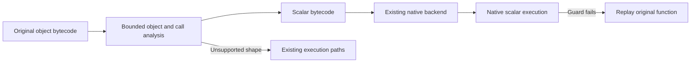

# Vec3 object inlining — September 8, 2026

The subsequent [PGO/LTO comparison](pgo-lto-after-vec3-2026-09-08.md) measures
freshly trained builds of this implementation. It improves memory/helper
paths while leaving the emitted Vec3 calculation effectively unchanged.

The unchanged, array-backed Vec3 benchmark now runs as native scalar code.
Five alternating before/after rounds measured **2,746.88 → 58.91 ns per
iteration, a 46.63× speedup**. Its ten temporary vectors per iteration no
longer allocate instances, arrays or element buffers. No benchmark-specific
class names or formulas are embedded in the compiler.

This implements the main opportunity identified in the
[Vec3 diagnosis](vec3-diagnosis-2026-09-08.md). The broader suite also exposes
small regressions in some memory-heavy kernels; these are recorded below.

## What changed

`sqjit_object_plan.cpp` owns bounded method/constructor inlining and scalar
replacement. It uses the existing bytecode operand, effect and control-flow
analysis to walk a closed numeric kernel and its callees. Ordinary methods,
arithmetic metamethods, constructors and default arguments become scalar
operations. The pass emits ordinary bytecode for the existing x64/AArch64
backends, keeping object analysis out of their instruction emitters.



The pass runs when existing whole-function compilation cannot handle the
program. Its private lowered prototype and native body are owned by the
original compiled artifact. Garbage collection marks the lowered prototype;
weak references preserve dependency identity without retaining obsolete
classes or closures.

Additional changes make useful object operations native independently:

- x64 whole functions can carry array-valued members and nested array reads.
  Borrowed owners remain in the VM stack or undo log. Paths that could replace
  their VM owners directly through array construction/append are rejected.
- Numeric array stores now share one checked lowering implementation between
  x64 functions and loops, retaining rollback and assignment-result handling.
- x64 mutators can return implicit null and commit their writes normally.
- AArch64 whole functions and loops guard their embedded closure root and
  retain its weak reference. Root fallback now rejects intervening instance
  lookup metamethods and default-delegate members. Mutation tests reproduced
  stale-root and skipped-delegate results before these fixes.

## Why scalar replacement is safe here

Only analyzed calls and local virtual-object mutations are admitted. External
effects, unknown callees, escaping objects, generators, captured environments,
inheritance and native class hooks reject the plan. Class construction is
eliminated only after the class is already locked, avoiding changes to the
observable first-construction behavior.

Every native invocation checks root class bindings, class defaults,
constructor/method/metamethod identities and closure roots. Unqualified class
references inside methods additionally guard against new instance members,
`_get` hooks and default-delegate entries that would shadow root lookup.

The loop analysis requires a stable alias graph. It preserves shared objects
and emits parallel scalar copies for object swaps at the backedge. A field
cannot acquire a new representation only inside the loop, which would make
the zero-trip path incorrect. Incompatible alias changes fall back.

Dynamic virtual array access checks each supported index. Invalid indices,
unexpected numeric types and other native guards return to the original
interpreter function. All preceding object writes were virtual local writes;
there is no external heap state to undo or escaping object to materialize.
Fractional indices that need interpreter truncation also fall back correctly.
The separate borrowed-array paths retain their normal write-log rollback.

## Measurements

i7-12700, Linux x86-64, pinned to CPU 0. Both SQGI builds use int64/double,
Release `-O3 -DNDEBUG -g`, JIT threshold 1, and PGO/LTO disabled. Each table
uses five fresh-process rounds and five full warmups. Startup, compilation,
profiling and allocation instrumentation are excluded from timed regions.
All equivalent checksums match. Saved evidence contains samples, commands,
versions, build settings and executable/source hashes.

The complete 15-kernel before/after comparison used 80,000 base iterations:

| Kernel | Before ns/iteration | After ns/iteration |
| --- | ---: | ---: |
| direct_call | 3.696 | 3.720 |
| branch_call | 2.956 | 2.963 |
| float_call | 6.553 | 6.647 |
| numeric_loop | 5.709 | 5.738 |
| **vector** | **2746.875** | **58.912** |
| dynamic_member | 267.375 | 256.213 |
| dynamic_key_get_set | 23.912 | 25.025 |
| object_member_write_fallback | 98.100 | 102.825 |
| array_append | 34.588 | 37.112 |
| array_write | 5.875 | 5.763 |
| array_read | 1.156 | 1.161 |
| array_float | 1.693 | 1.692 |
| math_intrinsic | 24.975 | 25.100 |
| math_variable | 44.250 | 45.088 |
| matrix | 67.913 | 72.850 |

Longer alternating runs of the three persistently slower kernels used
1,000,000 iterations. Object member writes measured 98.55 → 108.74 ns,
array append 36.45 → 38.54 ns, and matrix 73.06 → 77.34 ns: approximately
**10.3%, 5.7% and 5.9% slower**, respectively. Earlier rounds showed smaller
shifts, but the direction persisted. The cause has not been isolated; this
change should not be described as a speedup across all workloads. These
regressions remain follow-up work, alongside the much larger absolute gap
between SQGI and JavaScript on matrix and object member writes.

A fresh rotating comparison against the locally installed runtimes gives:

| Kernel | SQGI ns | Node 18 ns | GJS ns | Python ns |
| --- | ---: | ---: | ---: | ---: |
| **Vec3** | **58.63** | **179.55** | **144.56** | **1764.39** |
| Matrix | 72.61 | 7.09 | 14.09 | 343.33 |

For this Vec3 kernel SQGI is **3.06× faster than Node, 2.47× faster than GJS,
and 30.10× faster than Python**. This is a warmed microbenchmark result, not
an overall application ranking. GJS uses ES module mode. All 15 cross-runtime
rows are saved in the evidence.

The seven diagnostic variants also match with JIT enabled and disabled:

| Variant | Interpreter ns | JIT ns |
| --- | ---: | ---: |
| Array-backed objects, operators | 2679.01 | 59.25 |
| Array-backed objects, methods | 2629.48 | 59.86 |
| Field-backed objects, operators | 2072.56 | 2189.34 |
| Field-backed objects, methods | 1939.68 | 2054.13 |
| Reused objects, mutating methods | 1617.20 | 60.68 |
| Reused arrays | 458.88 | 85.51 |
| Scalar locals | 268.54 | 37.06 |

The field-backed variants still contain branched accessor methods that this
pass rejects. Supporting these methods is a concrete next extension.

## Allocation and profile evidence

The glibc counting preload compared 1,000, 2,000 and 4,000 iterations, holding
startup/reference work constant. Both differences agree: the original
kernel's **30 mallocs, 30 frees and 2,240 requested bytes per iteration become
zero**. Compilation and initial interpreted execution still allocate outside
the optimized loop. Instrumented timings are not used above.

A final `perf record` run sampled user-space core cycles at 997 Hz, with DWARF
stacks, one 20-million-iteration warmup and one measured call. It collected
**2,663 samples, zero lost samples, and 99.88% of cycles in generated JIT code**.
This replaces the earlier profile dominated by VM execution and lookup.
The anonymous JIT samples establish native execution, not attribution to
individual scalar instructions. Raw perf data remains in `/tmp`.

## Tests and boundaries

Validation passed: **94 Release tests, 94 ASan/UBSan tests with leak detection,
80 JIT-disabled tests, and 13 AArch64 core tests under QEMU**. The packaging
test with the previously failing external download was excluded. Win64 ABI
emitter checks are included in the host suite; Windows and ARM hardware
execution were not measured.

`test_sqjit_object_plan.cpp` loads the actual Vec3 definitions, compares three
eligible kernels against the interpreter over zero, negative, odd, even and
larger iteration counts, and asserts native frame/direct execution. Direct
artifact calls also check that no virtual object is written to the VM stack.
The original variants lower to 396 instructions/61 slots; reused objects use
411 instructions/43 slots. Both x64 and AArch64 execute these scalar plans.

Further cases cover defaults, int64/double results, dynamic/fractional/out-of-
bounds indices, shared objects, backedge swaps, rejected alias/layout changes,
escaping objects, constructor effects, class/constructor/method/root changes,
lookup shadowing and garbage collection. `test_sqjit_objects.cpp` checks
standalone member methods, implicit-null mutations, nested borrowed arrays,
displaced owners and guard failure after a write.

The pass is deliberately bounded: straight-line methods, one counted loop,
up to eight plain classes, eight fields/elements per object, 64 static virtual
objects, call depth 12, and 4,096 analyzed instructions. Generated scalar code
is limited to 2,048 instructions and the existing 255-slot limit; AArch64
retains its smaller 512-instruction backend limit. Unsupported programs keep
the existing execution paths. This does not add a general native constructor
frame bridge, arbitrary method control flow, or escaping-object materialization.

## Reproduction

```sh
python3 tools/run_execution_benchmarks.py \
  --baseline /tmp/sqgi-vec3-implementation-20260908/baseline-sqgi \
  --candidate /tmp/sqgi-vec3-audit-20260908/symbols/sqgi \
  --suite kernels --runs 5 --iterations 80000 --cpu 0 --output before-after.json

python3 tools/run_runtime_benchmarks.py \
  --sqgi /tmp/sqgi-vec3-audit-20260908/symbols/sqgi \
  --runs 5 --iterations 80000 --warmups 5 --cpu 0 --output runtimes.json

SQGI_JIT=1 SQGI_JIT_THRESHOLD=1 SQGI_JIT_TRACE=1 \
  /tmp/sqgi-vec3-audit-20260908/symbols/sqgi test/bench_vec3.nut \
  --only=arrays_operators --iterations=1000 --warmups=1
```

Trace output reports scalarized allocation sites, inlined calls and generated
instruction counts. [Saved evidence](vec3-implementation-2026-09-08.json)
includes all final timing samples, allocation data/probe source, focused
benchmark source, profile summary and test logs. Build/probe files and raw
profiles are in `/tmp/sqgi-vec3-implementation-20260908/`.

The candidate build has install prefix `/usr`. The repository's main `build/`
directory and installed runtime were not replaced by this implementation.
