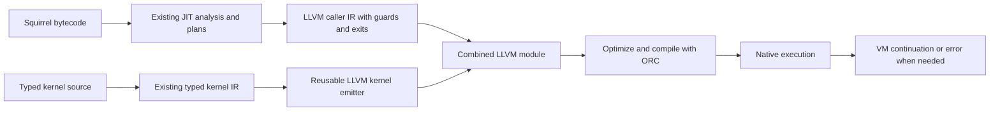

# Review: LLVM backend for the existing Squirrel JIT

Reviewed September 17, 2026 against the current working tree. This is an
architecture review and migration plan; no backend replacement is implemented.

**Recommendation: add LLVM as an alternative backend behind the existing JIT's
policy and analysis. Preserve the handwritten backends for comparison. Reuse the
typed-kernel frontend and refactor its LLVM lowering so kernel bodies can be
emitted into a caller's module. Do not keep expanding a separate bytecode tier.**

The old JIT has useful optimization machinery absent from the newer boxed LLVM
tier. In the preceding 60-case legacy comparison, the old JIT beat explicit LLVM
compilation in every case; none entered the newer promoted-region path. That is
evidence for reusing its analysis, not evidence that LLVM will automatically
improve the old backend. Execution speed, compilation latency and code coverage
must all be measured.

## Proposed compilation flow

## Existing integration points

| Component | Evidence in source | Reuse or change |
|---|---|---|
| JIT selection and compilation policy | [sqjit.cpp](../../Squirrel3/squirrel/jit/sqjit.cpp), [sqjit_policy.cpp](../../Squirrel3/squirrel/jit/sqjit_policy.cpp) | Retain thresholds, guarded specialization, retry/backoff and interpreter fallback. |
| Backend interface | [sqjit_backend.h](../../Squirrel3/squirrel/jit/sqjit_backend.h) | Implement `sqjit_backend_compile_proto`, `sqjit_backend_compile_loop` and loop-region selection for LLVM. Add an LLVM backend identity. |
| CFG, reads/writes and liveness | [sqbytecode.h](../../Squirrel3/squirrel/sqbytecode.h) | Reuse analysis; feed typed values and explicit exits to LLVM. |
| Scalar leaf analysis | [sqjit_leaf.h](../../Squirrel3/squirrel/jit/sqjit_leaf.h), [sqjit_leaf.cpp](../../Squirrel3/squirrel/jit/sqjit_leaf.cpp) | Reuse eligibility, bounded dataflow, argument/result kinds and branch facts. |
| Closed object scalarization | [sqjit_object_plan.h](../../Squirrel3/squirrel/jit/sqjit_object_plan.h) | Particularly useful: `Build`, `Guard`, `Lowered`, `Mark` already separate object analysis from backend compilation. `Lowered()` returns a Squirrel function prototype. |
| Members, virtual arrays, intrinsics | [sqjit_member_plan.h](../../Squirrel3/squirrel/jit/sqjit_member_plan.h), [sqjit_virtual_array.h](../../Squirrel3/squirrel/jit/sqjit_virtual_array.h), [sqjit_intrinsics.h](../../Squirrel3/squirrel/jit/sqjit_intrinsics.h) | Reuse plans and checked runtime operations. Port the emission and guard-placement decisions. |
| Representation joins | [sqjit_typeflow.h](../../Squirrel3/squirrel/jit/sqjit_typeflow.h) | Reuse conservative join validation initially. It consumes lowering's definition kinds; it is not a complete standalone typed IR. |
| Ownership and rollback | [sqjit_write_log.h](../../Squirrel3/squirrel/jit/sqjit_write_log.h) | Preserve observable release/weak-reference behavior. LLVM cannot infer these language rules. |
| Active VM and nested calls | [sqjit_context.h](../../Squirrel3/squirrel/jit/sqjit_context.h) | Retain invocation scope, active VM and active journal chain. |

The current compilation flow already tries C++ specializations, then an object
plan's lowered prototype, then ordinary backend compilation. An LLVM backend can
fit there without replacing the Squirrel parser, bytecode format or user language.

## Findings that determine the design

### 1. A backend boundary exists, but the frontend is not fully separated

`SQJitX64Calls::InlineLeaf` builds a portable `SQJitLeafPlan`, then immediately
copies arguments into machine-frame scratch slots and calls the x64 leaf emitter.
`SQJitX64Memory` combines member/array facts with a native code buffer, slot state,
register operations and machine condition-code callbacks. `compile_proto` and
`compile_loop` also perform eligibility/type decisions while emitting bytes.

Therefore an LLVM implementation is not a translation of `mov`/`add` emitter
methods into LLVM calls. Extract semantic decisions incrementally: typed slot
values, guards, calls, memory effects and exit state. Reuse the existing portable
plans directly first; do not require a full rewrite of both handwritten backends
before producing a runnable experiment. Also do not create a grand unified source
language IR: a small backend-neutral region description is sufficient.

The helper operations currently housed in `sqjit_backend_x64_helpers.*` include
portable C++ runtime semantics. Move the necessary helpers into a shared runtime
unit rather than depending on the entire x64 compiler. Audit the AArch64 precise
helpers as well; similar names do not establish equivalent ownership contracts.

### 2. Effectful kernels cannot use the old replay contract unchanged

The backend ABI distinguishes `GUARD_FAILED`, `RETURNED` and `SIDE_EXIT`. The VM's
`sqjit_try_execute_current` validates frame identity and an exact continuation PC
for committed side exits. Frameless calls reject `_requires_vm_frame` artifacts.

However, the x64 backend ignores `allow_side_exits` and uses a rollback/replay
path. Its journals cover Squirrel stack/array/member ownership and writes.
**Typed kernel buffers and class cells are separate storage, not covered by that
journal. A kernel write followed by a late guard failure cannot restart safely.**

Use this contract for the new backend:

- A replayable guard failure is permitted only before effects, or after a proven
  complete rollback of everything the region changed.
- After a kernel or other committed effect, materialize live VM state and resume
  at the exact next/failing instruction. Never restart the function or roll back
  only its Squirrel-visible portion.
- A kernel status error may follow writes. Preserve those writes, set the VM
  error and propagate an execution error; never retry the kernel in the VM.
- Mark effectful/side-exiting artifacts as requiring a real VM frame. Do not
  route them through the old Boolean frameless-call API, which cannot represent
  all these outcomes safely.
- Keep object-plan scalarization's current non-side-exiting contract initially;
  adding exits would also require reconstructing eliminated objects.

This is the principal prerequisite for stateful kernel integration. Use the
existing VM continuation machinery, but implement and test an LLVM producer of
that contract; x64 having a passing dispatch test does not supply such a producer.

### 3. Kernel LLVM lowering currently owns compilation, not just IR emission

[src/kernel/llvm.cpp](../../src/kernel/llvm.cpp) creates an ORC JIT, context,
module, `kernel_entry(Call*)`, target machine and optimization pipeline for each
lowered function. [PreparedCall](../../src/kernel/kernel.h) exposes an executable
pointer and a floating-environment flag. A pointer alone is insufficient for
cross-boundary LLVM inlining. Sharing an ORC JIT alone is insufficient too: the
optimizer needs both bodies visible together in IR.

Refactor into two internal layers:

1. `emit_kernel_ir` (proposed API): emit a validated `sqkernel::Function` into a
   supplied LLVM module/context with a unique symbol, returning its LLVM function.
2. Standalone compilation: use that emitter, retain the existing `Call*` ABI,
   optimization, executable ownership and external adapter behavior.

For a specialized Squirrel caller, emit the selected kernel body into the same
module, call it directly, and optimize the combined module. Start with the current
`Call*` ABI: scalar replacement can remove nonescaping argument/result storage.
Only introduce an internal scalar-argument ABI if measurements justify it.
Retain the source module and guard the live callable/receiver; do not cache bare
userdata pointers or assume a mutable method delegate stays unchanged.

The current [kernel descriptor](../../src/kernel/inline.h) already exposes owned
kernel IR, callable identity and a prepared entry. Its implementation is guarded
by `SQGI_ENABLE_LLVM_SQUIRREL`, which CMake disables when `SQ_ENABLE_JIT=ON`.
Split kernel-call metadata capability from the experimental bytecode tier's
registration/build flag so the legacy JIT's LLVM backend can use it.

### 4. Kernel floating semantics and fuel are part of the interface

Kernel `execute` normalizes rounding/FTZ/DAZ and masks exceptions, then restores
the caller's complete MXCSR on both success and failure. Ordinary Squirrel
arithmetic does not have that same per-kernel wrapper. Inlining floating IR and
silently removing the wrapper changes semantics, including exception flags.

First integrate pure integer kernels. For floating kernels, preserve the wrapper
or provide an explicitly modeled environment region with suitable ordering and
floating IR semantics. Hoisting it across arbitrary caller operations is not
valid without a proof. Keep requirements, bounds, error source locations and the
per-invocation fuel reset; inlining must not combine several calls' fuel budgets.
The existing hostile-environment and failure-after-write tests are required gates.

### 5. Executable ownership and platform selection require explicit changes

`SQJitCode` currently owns executable byte mappings or borrows C++ stubs. An ORC
entry must own its ORC resources until the artifact dies. Add type-erased external
code ownership/release to the artifact, retaining dependency ownership and weak
references. `SetStub` alone would either leak ORC resources or leave a dangling
entry. Do not pass an ORC entry to the current `munmap`/`VirtualFree` path.

CMake currently computes `SQGI_JIT_BACKEND` from the host, and `sqjit_platform.h`
computes capabilities directly from architecture. Introduce an explicit bytecode
backend selection independent of `SQGI_KERNEL_BACKEND`; keep auto/native defaults
unchanged during evaluation. Factor LLVM dependency discovery out of the
kernel-only condition so bytecode LLVM can be built independently. Initially
validate Linux x64; LLVM's target support does not itself validate our VM ABI,
floating environment, Windows unwind behavior or AArch64 execution.

The newer `src/sqgi_llvm.cpp` should remain a comparison prototype until equivalent
features are migrated. Do not activate both independent bytecode-entry mechanisms
for the same function. Reuse its tested guards/materialization ideas selectively,
not its repeated per-op interpreter handoff strategy as the new default.

## Proposed milestones and acceptance gates

| Milestone | Concrete deliverable | Gate |
|---|---|---|
| 1: backend plumbing | Selectable LLVM backend, ORC-owned artifacts, old JIT ABI/policy/diagnostics, integer arithmetic/branches/division/remainder and rejected unsupported shapes | Real native execution assertions; correct wrapping, division edge cases, entry guards and code lifetime; no silent interpreter-only pass. |
| 2: first comparative experiment | Ordinary scalar calls in loops using `SQJitLeafPlan`; private arguments and branch joins preserved | `direct_call`, `branch_call`, `numeric_loop`, leaf/values/contracts tests; measured compile time, native coverage and warmed speed against handwritten code. |
| 3: shared kernel IR | Pure integer kernels emitted into the caller module with identity/type guards | Optimized IR proves the indirect kernel boundary disappeared; changed targets and dropped owners remain correct; existing kernel checksums match. |
| 4: committed exits | Frame-based exits/errors with explicit effect boundaries, then stateful kernel calls | Type/callee changes after writes, GC/reentry, release hooks, errors/fuel after writes, hostile FP state; no replay and no partial rollback. |
| 5: legacy coverage | Object-plan lowered bytecode, then array/member/virtual-array/intrinsic lowering in measured order | Recover `vector`, array and member coverage; run all 60 legacy cases, kernel suites and representative GI workloads; retain regressions in reports. |

The first experiment ends after milestone 2, with a go/no-go report. It must prove
reuse of the old leaf analysis and actual native loop execution; matching a toy
arithmetic benchmark is insufficient. Unsupported regions should decline
compilation cheaply and use the interpreter, rather than installing a slower
helper/dispatch wrapper. Keep native backends available and avoid changing defaults
until coverage, correctness and compilation costs warrant it.

## Validation performed during this review

Built and ran these tests against the current Linux x64 handwritten JIT,
RelWithDebInfo, LTO/PGO off, in `/tmp/sqgi-legacy-jit-compare`:

- Passed: `sqjit_contracts`, `sqjit_side_exit`, `sqjit_values`,
  `sqjit_object_plan`, `sqjit_write_log`, and the focused `sqjit_release_order`.
- Failed: `sqjit_leaf` has one native-loop coverage assertion;
  `sqjit_member_plan` has five native whole-function reference-store coverage
  assertions (`capture_ref`, `replace_ref`, `receiver_ref`, `nested_ref`,
  `capture_late`). No value mismatch was reported in these selected runs.
- That is **6/8 selected test programs passing**, not a clean old-JIT suite.
  The conservative ownership fallback and remaining coverage gaps are documented
  in the [prior investigation](../jit-member-plan-investigation-2026-09-15.md).
- The side-exit test passes the x64 frame-dispatch contract checks. Its native
  precise-emission groups are conditional on the external/AArch64 capability;
  that pass is not evidence of an existing precise LLVM or x64 emitter.

Port semantic tests to capability-based expectations for LLVM. Keep machine-byte
inspection/emitter tests architecture-specific. Preserve current failing coverage
assertions and track them separately from semantic failures; do not weaken the
tests to make a new backend look complete. None of these runs validates the
proposed backend, which has not yet been implemented.

Implementation follow-up: [first LLVM bytecode prototype](llvm-bytecode-prototype.md)
records the implemented subset, new native-coverage tests and initial timings.
The validation above describes the pre-implementation review baseline.
